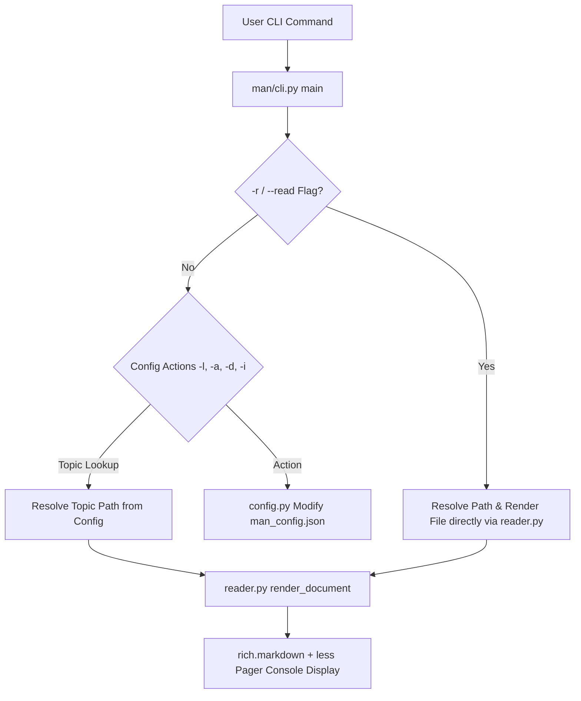

# 📄 Where We Are Now — `man` Engineering State Replay

---

# Metadata

| Field | Value |
|--------|-------|
| Document | `021-where-we-are-now.md` |
| Category | AFK Replay Framework |
| Type | Engineering State Reconstruction |
| Status | 🟢 Active |
| Version | 2.0 |
| As Of | 2026-08-13 |

---

# 1. Executive Summary

`man` is located at `C:\Users\ErTSantos\Documents\_Codes\_Project\man`.

During this session, `man` was refactored with the **`-r` / `--read <path.md>`** CLI parameter ([`man/cli.py`](file:///c:/Users/ErTSantos/Documents/_Codes/_Project/man/man/cli.py#L12-L35)), enabling direct reading of any Markdown file on the filesystem without adding it to `man_config.json`.

---

# 2. System Architecture



---

# 3. Code Base File Map

| File Path | Description |
| :--- | :--- |
| [`man/cli.py`](file:///c:/Users/ErTSantos/Documents/_Codes/_Project/man/man/cli.py) | CLI argument parser & execution router (includes `-r` handling) |
| [`man/config.py`](file:///c:/Users/ErTSantos/Documents/_Codes/_Project/man/man/config.py) | Config manager (`man_config.json` initialization, loading, add, delete, path resolution) |
| [`man/reader.py`](file:///c:/Users/ErTSantos/Documents/_Codes/_Project/man/man/reader.py) | Markdown renderer using `rich.console`, `rich.markdown`, and Git Bash `less` pager |
| [`readme.md`](file:///c:/Users/ErTSantos/Documents/_Codes/_Project/man/readme.md) | Technical guide and usage reference |

---

# 4. Verified Execution Commands

```powershell
# Read a specific Markdown file directly (-r)
man -r "C:\Users\ErTSantos\Documents\_Codes\_Project\audio-engine\manuals\make-srt-manual.md"

# Read relative Markdown file
man -r README.md

# List registered topics
man -l

# Read registered topic
man man
```
