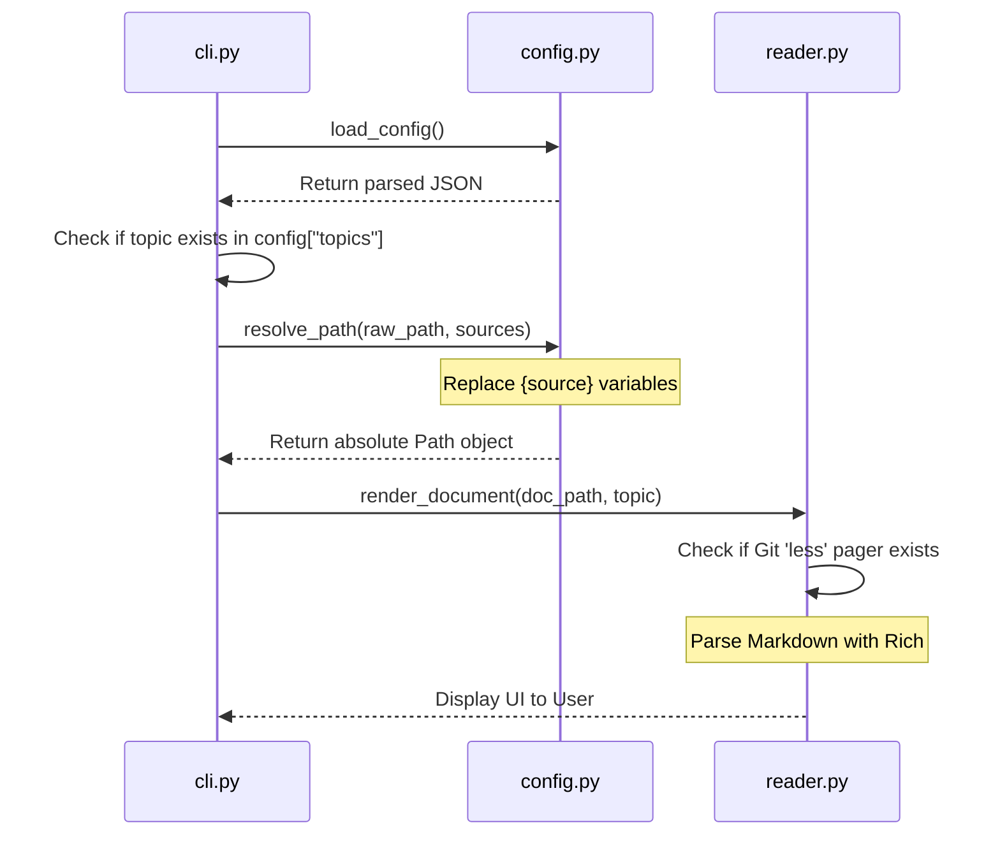
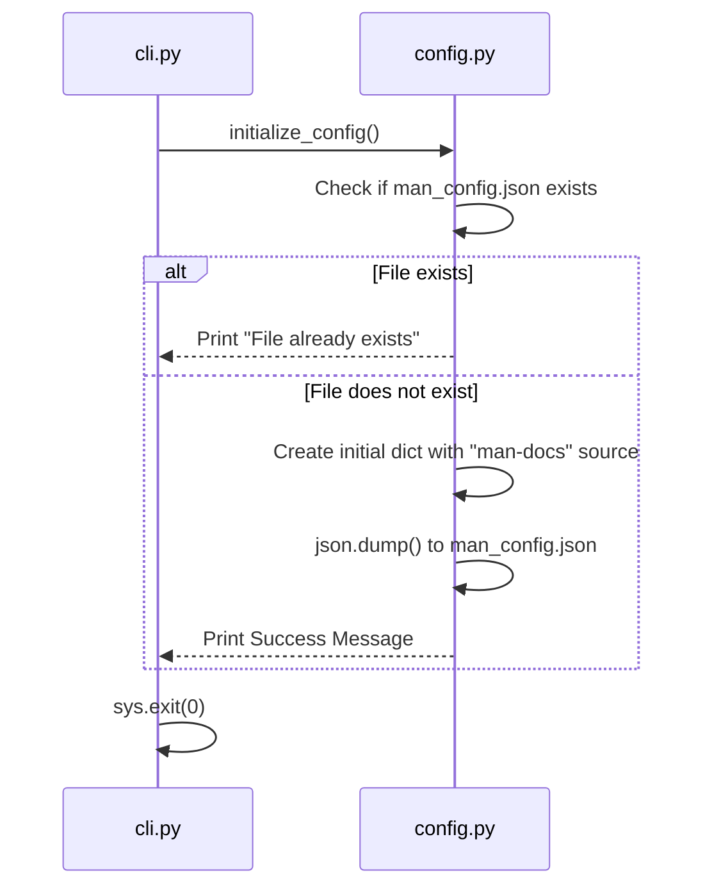
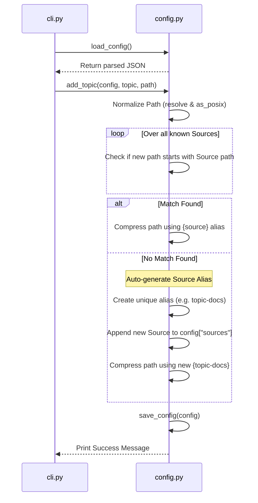
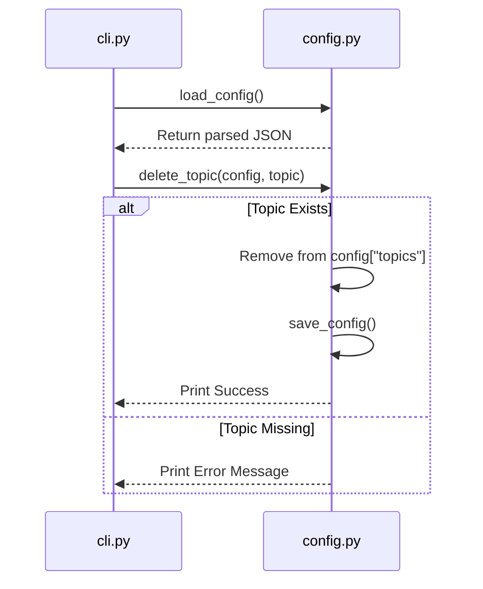

# 🔀 Code Execution Flows

This document outlines the execution path across the new multi-file architecture (`cli.py`, `config.py`, `reader.py`) for the core commands in the `man` utility.

---

## 1. Reading a Topic (`man <topic>`)

When a user requests to read a manual page, the flow is designed to safely load configurations, resolve variables, and stream the markdown to the pager.

---

## 2. Initialization (`man -i` or `man --init`)

This command safely generates the underlying JSON infrastructure if it doesn't already exist.

---

## 3. Adding a Topic (`man -a <topic> <path>`)

The addition flow contains the most complex logic, handling path normalization, dynamic templating, and automatic source generation.

---

## 4. Deleting a Topic (`man -d <topic>`)

A straightforward process to remove aliases safely.

